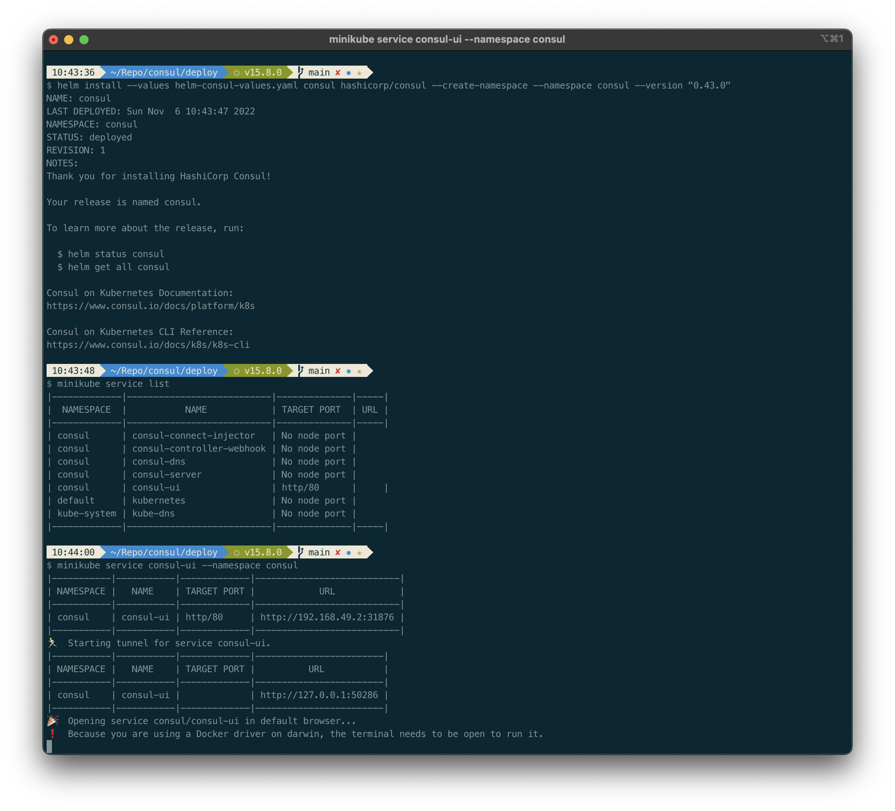
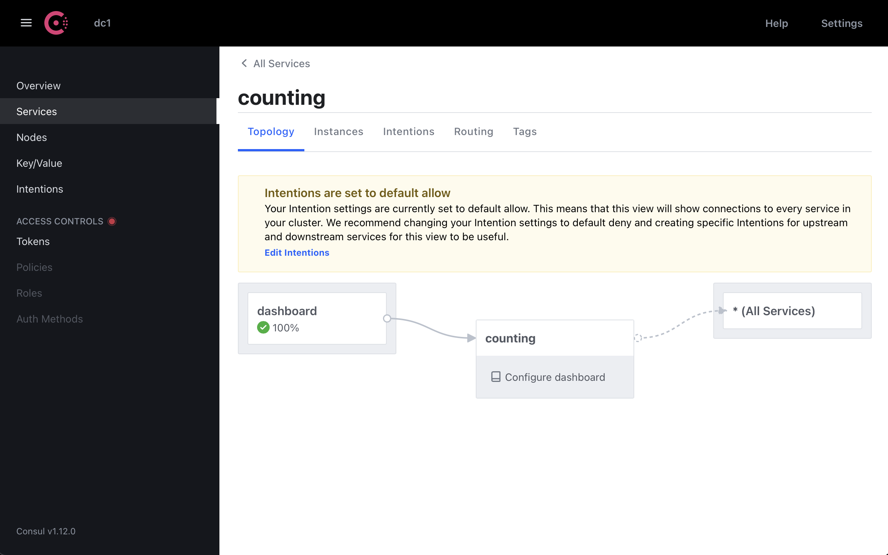
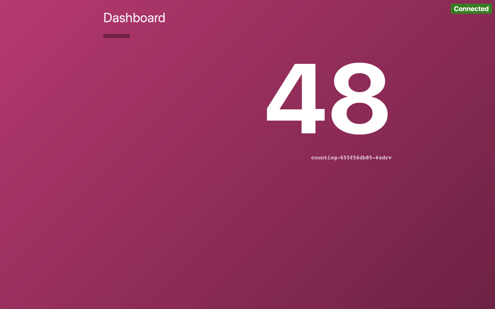

# Development Workstation Setup using Minikube

We will install the demo services and secure them using intentions. The following steps were taken to run Consul locally.

1. [Install Minikube](https://k8s-docs.netlify.app/en/docs/tasks/tools/install-minikube/)
    -Note for Mac arm64: install and start [Docker arm64](https://desktop.docker.com/mac/main/arm64/Docker.dmg?utm_source=docker&utm_medium=webreferral&utm_campaign=dd-smartbutton&utm_location=module) then
    ```bash
    brew install minikube
    brew install consul
    minikube start --memory 4096 --vm-driver=docker 
    ```
1. Start Minikube (on Mac arm64 see above)
   ```bash
   minikube start --memory 4096
   ```
1. Create [Helm values file](./deploy/helm-consul-values.yaml)
1. Install Consul in K8s
    ```bash
    helm repo add hashicorp https://helm.releases.hashicorp.com
    
    cd ./deploy
    
    helm install --values helm-consul-values.yaml consul hashicorp/consul --create-namespace --namespace consul --version "0.43.0"
    
    minikube service list

    minikube service consul-ui --namespace consul
    ```
1. Open a new Terminal window and use kubectl to check the Consul member instances
    ```bash
    kubectl exec --stdin --tty consul-server-0 --namespace consul -- /bin/sh

    (when connection ready)
    consul members

    (members listed)
    exit
    ```

    
    

## Testing Service Intentions

Followed [tutorial](https://developer.hashicorp.com/consul/tutorials/kubernetes/kubernetes-minikube) and created and tested intentions with services.

1. Create two sample Helm service deployments, [counting.yaml](./deploy/counting.yaml) and [dashboard.yaml](./deploy/dashboard.yaml)
1. Deploy services
    ```bash
    kubectl apply -f counting.yaml

    kubectl apply -f dashboard.yaml
    ```
1. Use the UI dashboard 'Services' section to view services. Wait until all services are running and healthy.
1. Forward ports:
    ```bash
    kubectl port-forward deploy/dashboard 9002:9002
    ```
1. Open [127.0.0.1:9002](http://127.0.0.1:9002)
1. Secure pod traffic with intentions. Create deny.yaml, open another Terminal and send command:
    ```bash
    kubectl apply -f deny.yaml
    ```
1. Go back to service counter UI, note that change is immediate. Remove the deny rule.
    ```bash
    kubectl delete -f deny.yaml
    ```
1. Note that change is applied and connection works



## Testing Zero Trust

1. Navigate to Console UI 'intentions' and create a new rule. The rule should be 'Deny' from * to *, name it 'deny all' and apply. Note that the counter page does not work.
1. Add new rule:
    - Allow, dashboard to counter, name 'dashboard -> counter'
1. Note that the service now works, and we are in zero trust as the last rule drops connections not covered by pattern.

Expanded the tutorial and used [zero-trust configuration](https://developer.hashicorp.com/consul/tutorials/kubernetes-features/service-mesh-zero-trust-network) instead.

1. Deleted all manually created intentions
1. Created [deny-all.yaml](./deploy/deny-all.yaml) and [service-to-service.yaml](./deploy/service-to-service.yaml)
1. Block traffic
    ```bash
    kubectl apply -f deny-all.yaml
    ```
1. Verify service offline then run
    ```bash
    kubectl apply -f service-to-service.yaml
    ```
1. Verify service works as expected
