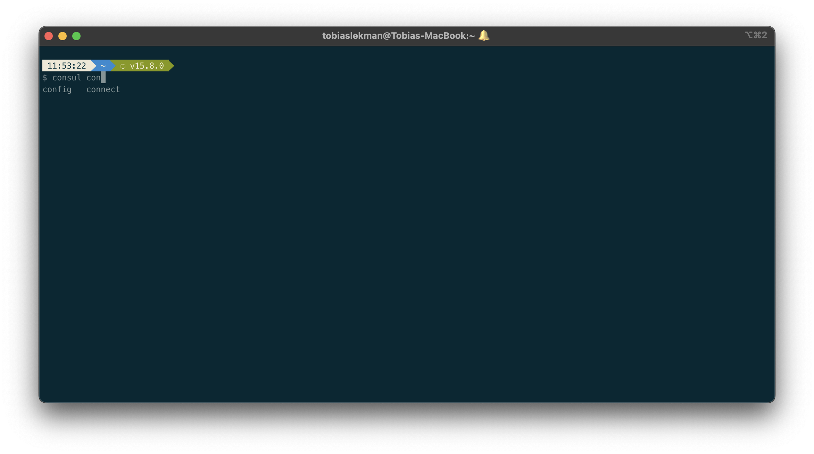

# Course: Getting Started with HashiCorp Consul

The course [Getting Started with HashiCorp Consul](https://app.pluralsight.com/library/courses/hashicorp-consul-getting-started-cert/table-of-contents) follows the [certified Hashicorp Consul associate certification path](https://app.pluralsight.com/paths/certificate/hashicorp-certified-consul-associate) on Pluralsight.

## Course Contents

The course covers:

- Installing and Running Consul in Dev Mode
- Service Registration and Discovery
- Service Reliability with Health Checks and Scalability
- Dynamic Configuration with Consul’s KV Store
- Managing Cluster Membership
- A Full-fledged Service Mesh with Connect

## Consul Features

Consul is fully platform agnostic. Consul is [fully open source](https://github.com/hashicorp/consul). Consul handles the following areas within a Kubernetes cluster:

- Service discoverability, both internal and external allowing you to mix containers with EC2 VMs, server-less services and external services
- Secure communication between services
- Load balancing
- Automatic scaling
- Feature toggles on services (for example, route outgoing call to internal or external service)

## Compatiblity with Dev Environment

We [previously installed a dev environment](./DEV.md) and the consul CLI needs to be configured to talk to it.

Get the IP address to use:

```bash
$ minikube service consul-ui --namespace consul
|-----------|-----------|-------------|---------------------------|
| NAMESPACE |   NAME    | TARGET PORT |            URL            |
|-----------|-----------|-------------|---------------------------|
| consul    | consul-ui | http/80     | http://192.168.49.2:31876 |
|-----------|-----------|-------------|---------------------------|
🏃  Starting tunnel for service consul-ui.
|-----------|-----------|-------------|------------------------|
| NAMESPACE |   NAME    | TARGET PORT |          URL           |
|-----------|-----------|-------------|------------------------|
| consul    | consul-ui |             | http://127.0.0.1:51851 |
|-----------|-----------|-------------|------------------------|
```

Note the second tunnel for consul-ui. Add this to the environment variable CONSUL_HTTP_ADDR. 

Mac
```bash
export CONSUL_HTTP_ADDR=http://127.0.0.1:51851
```

PC
```bash
set CONSUL_HTTP_ADDR=http://127.0.0.1:51851
```

Now the CLI works as expected:
```bash
consul members
Node             Address          Status  Type    Build   Protocol  DC   Partition  Segment
consul-server-0  172.17.0.5:8301  alive   server  1.12.0  2         dc1  default    <all>
minikube         172.17.0.3:8301  alive   client  1.12.0  2         dc1  default    <default>
```

## REST API

Consul has exposed REST API endpoints for getting all standard information, such as agent status, services etc. Refer to the [API docs](https://developer.hashicorp.com/consul/api-docs) for more info.

## DNS

We can register services as DNS hosts with routing. Useful for legacy applications. Registering an external service in Consul using DNS:

```bash
consul services register -name shipments -address 10.0.0.30 -port 8080
```

Then fetch using:

```bash
dig @127.0.0.1 -p 8600 shipments.service.consul -t SRV
```

### CLI Autocomplete

Install using

```bash
consul -autocomplete-install
```

Now, returns auto completion on all partial commands:


